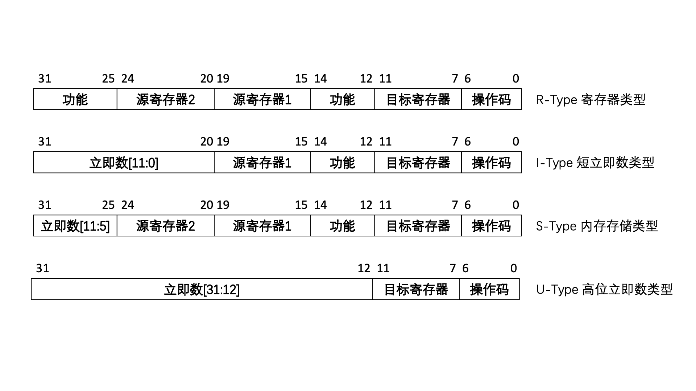
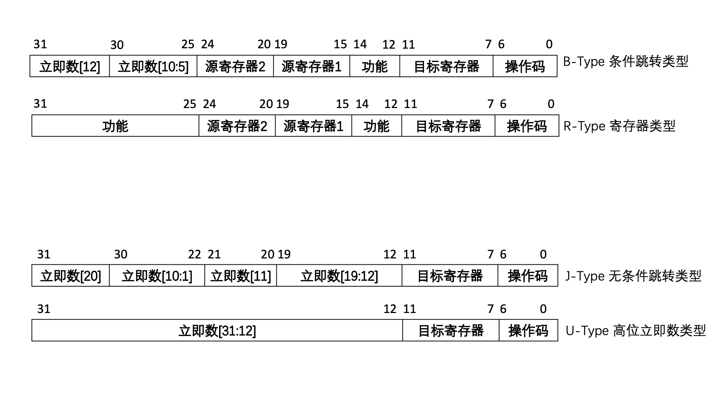
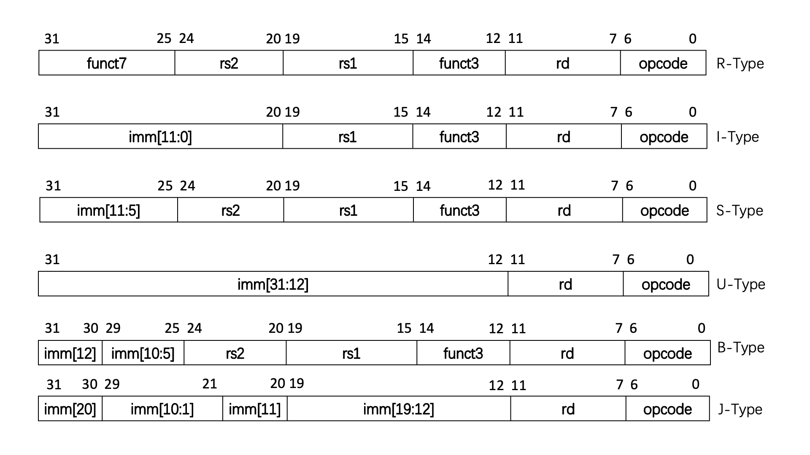
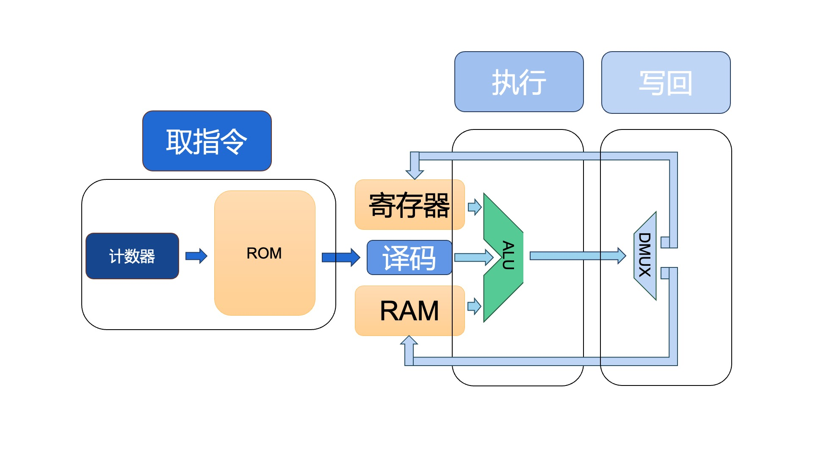
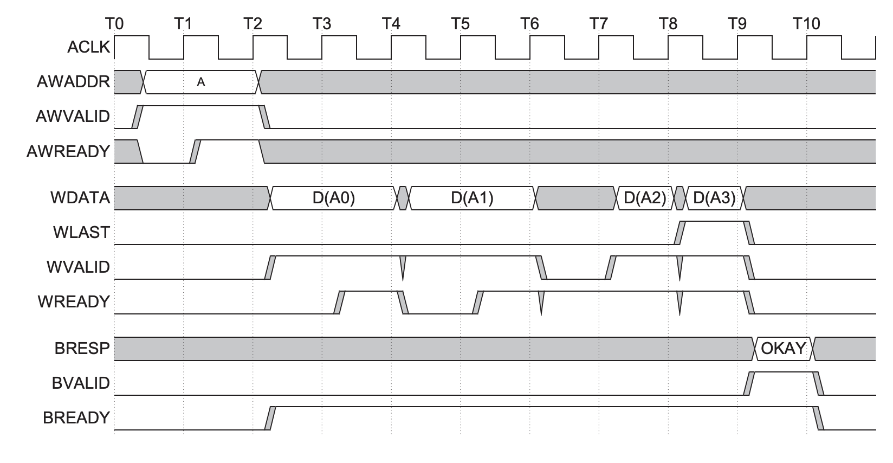
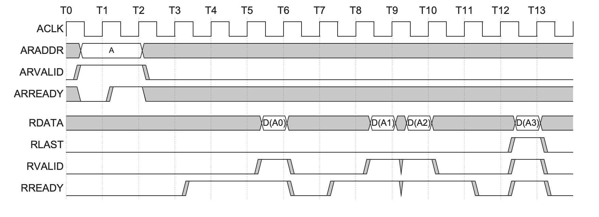
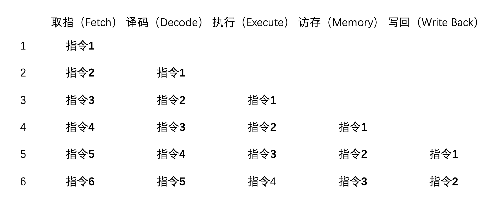

摘要：本项目是为了设计实现一款基于指令集RISC-V的核心架构，并通过Verilog语言在FPGA上进行验证。InnovationPractice_32bit_v0

# 0 项目开发背景概述

## 0.1 嵌入式系统概述

嵌入式系统是一种特殊的计算机系统，它通常是由专用的硬件和软件组成的，用于执行特定的任务。嵌入式系统通常被嵌入到一些更大的系统中，例如：汽车、家电、工业控制系统等。嵌入式系统的特点是：资源受限、功耗低、体积小、成本低、实时性要求高。

嵌入式系统的硬件通常是由一些专用的芯片组成的，例如：单片机、FPGA、ASIC等。嵌入式系统的软件通常是由一些专用的操作系统和应用程序组成的，例如：VxWorks、uC/OS、Linux等。

通常来说，控制密集型的嵌入式系统通常使用软件来实现，而计算密集型的嵌入式系统需要使用硬件来实现。

这是因为，计算操作所需要的大量运算，对处理器的吞吐能力有很大需求，因此需要设计专门的数字逻辑电路来实现。例如个人电脑中GPU图形处理器，就是一种专门的数字逻辑电路，用于处理图形数据。

## 0.2 FPGA概述

传统的数字芯片设计是通过定制化的ASIC（Application Specific Integrated Circuit）芯片来实现的，这种芯片的设计周期长、成本高，而且一旦设计完成就无法更改。因此，数字芯片的设计是一个高风险、高成本的过程。

为了解决这个问题，人们提出了FPGA这种可编程逻辑器件。FPGA（Field-Programmable Gate Array）即现场可编程门阵列，是一种可编程逻辑器件。因为任何数字电路都可以被看作是由逻辑门组成的，只要逻辑门的种类和数量足够多，就可以实现任何数字电路。FPGA就是利用这一原理，将大量的可编程逻辑单元（PLD）和可编程互连资源（Interconnect）集成在一块芯片上，用户可以通过编程来改变这些逻辑门的连接方式，从而实现任意的数字电路。

## 0.3 RISC-V概述

RISC-V是一个基于精简指令集（RISC）原则的开源指令集架构（ISA），它是由加州大学伯克利分校于2010年提出的。RISC-V中的V是罗马数字5的意思，源自于伯克利分校在20世纪80年代开发的一系列RISC指令集项目。RISC-V指令集是一个简洁、模块化的指令集，它吸取了现有的指令集的优点、总结了缺点，同时也考虑了未来的发展。RISC-V指令集是一个开源的指令集，任何人都可以免费使用，这使得RISC-V指令集在开源界得到了广泛的拥护。

### 0.3.1 RISC与CISC的区别

RISC（Reduced Instruction Set Computer）是精简指令集计算机的缩写，CISC（Complex Instruction Set Computer）是复杂指令集计算机的缩写。RISC和CISC是两种不同的计算机体系结构，它们的区别主要体现在指令集的复杂度上。

CISC指令集的指令非常复杂，一条指令可以完成很多操作，这样的指令集可以减少程序的指令数，提高程序的运行速度。但是，为了实现复杂的指令集指令，CISC的硬件实现非常复杂，而且指令的执行速度也不一定快。因此在相同频率下，CISC往往会占用更多的芯片面积，功耗也更高。

CISC的优点是指令的密度高，程序的长度短。但是，随着技术的发展，存储器的价格越来越便宜，程序的长度已经不再是一个问题。

造成CISC指令集的复杂性的原因是历史原因，20世纪80年代单片机刚刚问世时，半导体制造工艺较为落后，处理器能够达到的时钟频率偏低，硬件设计方式较为原始、软件设计多靠手工汇编。因此，为了提高程序的执行速度，CISC指令集的指令非常复杂，一条指令尽可能的完成更多操作。指令集的庞大也导致了变长指令的出现，这使得指令的解码变得更加繁琐。

随着工艺水平的提高，处理器的时钟频率不断提高，硬件设计方式的进步，软件设计方式的进步，CISC指令集的复杂性已经不再是一个优势。因此，RISC指令集逐渐成为了主流。

RISC-V指令集规模小、指令格式更加规整，并且对内存的访问更加规范，只能通过LOAD和STORE指令来访问内存。这样的指令集可以使得处理器的设计更加简单，同时也可以提高处理器的性能。

### 0.3.2 RISC-V和其他RISC指令集的区别

RISC-V采用了模块化的设计，它的指令集被分为了基本指令集（RV32I）、标准扩展（RV32M、RV32A、RV32F、RV32D）、特权指令集（RV32S、RV32H、RV32V）等。这种模块化的设计使得RISC-V指令集可以根据应用的需求进行灵活的扩展，避免了随着时间的推移而产生的指令集膨胀的问题。

Risc-V取消了标志寄存器。（详见[#1.1.3.2.2]）

RISC-V是一个开源的指令集，任何人都可以免费使用，RISC-V的开源性使得它可以在各种不同的领域得到应用，例如：嵌入式系统、服务器、超级计算机等。

## 0.4 参考资料

  [1] mict_s_a0006268173_1-2290967.pdf, DDR3L说明文档,[https://www.mouser.com/datasheet/2/671/mict_s_a0006268173_1-2290967.pdf](https://www.mouser.com/datasheet/2/671/mict_s_a0006268173_1-2290967.pdf)

  [2] IHI0022K_amba_axi_protocol_spec.pdf, AXI总线说明文档,[https://developer.arm.com/documentation/ihi0022/latest/](https://developer.arm.com/documentation/ihi0022/latest/)

  [3] IHI0022C_amba_axi_v2_0_protocol_spec.pdf, AXI总线说明文档v2.0, [https://documentation-service.arm.com/static/5f915971f86e16515cdc34a6](https://documentation-service.arm.com/static/5f915971f86e16515cdc34a6)

  [3] riscv-spec-20191213.pdf, RISC-V说明文档, [https://riscv.org/wp-content/uploads/2019/12/riscv-spec-20191213.pdf](https://riscv.org/wp-content/uploads/2019/12/riscv-spec-20191213.pdf)

  [4] riscv-card, RISC-V指令卡片, [https://github.com/jameslzhu/riscv-card](https://github.com/jameslzhu/riscv-card)


# 1 RISC-V指令集格式

RISC-V主要分为两个部分：用户指令集和特权指令集。

其中，用户指令集又分为基础整数指令集和扩展指令集。基础整数指令集又根据数据位宽分为32位、64位、128位三种。分别被称作RV32I、RV64I、RV128I。另外还有一种特别为嵌入式系统设计的32位指令集，称作RV32E。它考虑到嵌入式系统资源稀缺的情况，所以通用寄存器数量只有RV32I的一半，即16个。但是对于FPGA来说，资源并不是一个问题，所以仍然以RV32I为基础进行设计。

扩展指令集又根据功能有乘除法扩展（M）、浮点扩展（F）、双精度浮点扩展（D）等。

## 1.1 基础整数指令集（RV32I）

RV32I是RISC-V指令集中最基础的整数指令集，它是RISC-V指令集的核心部分。RV32I指令集中的指令主要是整数运算指令，包括算术运算、逻辑运算、移位运算、比较运算等。RV32I指令集中的指令主要是对32位整数进行操作。

### 1.1.1 RV32I通用寄存器

RV32I共有32个通用寄存器，分别用x0~x31表示。其中x0是零寄存器，只读且永远为0。x1~x31是通用寄存器，可以读写。

通用寄存器往往也有独特的功能。

| 寄存器编号 | 汇编名称 | 说明 |
|---|---|---|
| x0 | zero | 永远为0 |
| x1 | ra | 返回地址 |
| x2 | sp | 栈指针 |
| x3 | gp | 全局指针 |
| x4 | tp | 线程指针 |
| x5~x7 | t0~t2 | 临时寄存器 |
| x8 | s0/fp | 保存寄存器/帧指针 |
| x9 | s1 | 保存寄存器 |
| x10~x11 | a0~a1 | 参数寄存器 |
| x12~x17 | a2~a7 | 参数寄存器 |
| x18~x27 | s2~s11 | 保存寄存器 |
| x28~x31 | t3~t6 | 临时寄存器 |

### 1.1.2 RV32I指令格式

RV32I指令格式分为R型、I型、S型、U型、B型、J型六种。



（勘误：这里S型立即数指令的[11:7]位并不应该是“目标寄存器“，而是”立即数[4:0]“。）

上图所示的即为最主要的4种指令的指令格式，其中R型指令是寄存器-寄存器指令，I型指令是立即数-寄存器指令，S型指令是寄存器-立即数指令，U型指令是立即数指令。

此外，还有B型指令是和J型指令，分别是分支指令和跳转指令。B型指令衍生于R型指令，而J型指令衍生于U型指令。它们的对比如下所示：



（勘误：这里的B型指令的[11:7]位也不是“目标寄存器“，而是”立即数[4:0,11]“。）

上面这些指令，除了R型指令外，其他的指令都是立即数指令。最高位均需要进行符号位扩展，以产生一个32位的立即数，作为操作数。

为了在接下来的内容中描述这些指令，将使用opcode表示操作数，rd表示目的寄存器，rs1表示源寄存器1，rs2表示源寄存器2，imm表示立即数，funct3表示三位长的功能码，funct7表示七位长的功能码。



### 1.1.3RV32I指令集指令

RV32I指令集中的指令主要分为以下几类：

- 算术与逻辑指令（11条立即数指令、10条寄存器指令）

- 控制转移指令（2条无条件跳转指令、6条条件跳转指令）

- 加载存储指令（5条加载指令、3条存储指令）

- 内存同步指令（2条）

- 控制与状态寄存器指令（6条）

- 环境调用和系统断点指令（2条）

上面总共是47条指令。下面将会列出这些指令的总表。也可以参考[指令卡片](https://github.com/jameslzhu/riscv-card)或指令集手册。

[算数与逻辑指令立即数指令](#11311-立即数指令)：

| 指令 | 说明 | 描述 |
|---|---|---|
| addi | 立即数加法 | rd = rs1 + imm |
| slti | 立即数小于 | rd = (rs1 < imm) ? 1 : 0 |
| sltiu | 无符号立即数小于 | rd = (rs1 < imm) ? 1 : 0 |
| xori | 立即数异或 | rd = rs1 ^ imm |
| ori | 立即数或 | rd = rs1 \| imm |
| andi | 立即数与 | rd = rs1 & imm |
| slli | 逻辑左移 | rd = rs1 << imm |
| srli | 逻辑右移 | rd = rs1 >> imm |
| srai | 算术右移 | rd = rs1 >>> imm |
| lui | 加载高位立即数 | rd = imm << 12 |
| auipc | 加载高位立即数到pc | rd = pc + (imm << 12) |

[算数与逻辑指令寄存器指令](#11312-寄存器指令)：

| 指令 | 说明 | 描述 |
|---|---|---|
| add | 寄存器加法 | rd = rs1 + rs2 |
| sub | 寄存器减法 | rd = rs1 - rs2 |
| slt | 寄存器小于 | rd = (rs1 < rs2) ? 1 : 0 |
| sltu | 无符号寄存器小于 | rd = (rs1 < rs2) ? 1 : 0 |
| xor | 寄存器异或 | rd = rs1 ^ rs2 |
| or | 寄存器或 | rd = rs1 \| rs2 |
| and | 寄存器与 | rd = rs1 & rs2 |
| sll | 逻辑左移 | rd = rs1 << rs2 |
| srl | 逻辑右移 | rd = rs1 >> rs2 |
| sra | 算术右移 | rd = rs1 >>> rs2 |

[控制转移指令](#1132-控制转移指令):

| 指令 | 说明 | 描述 |
|---|---|---|
| jalr | 间接跳转 | rd = pc + 4; pc = rs1 + imm |
| jal | 直接跳转 | rd = pc + 4; pc = pc + imm |
| beq | 相等分支 | pc = (rs1 == rs2) ? pc + imm : pc + 4 |
| bne | 不等分支 | pc = (rs1 != rs2) ? pc + imm : pc + 4 |
| blt | 小于分支 | pc = (rs1 < rs2) ? pc + imm : pc + 4 |
| bge | 大于等于分支 | pc = (rs1 >= rs2) ? pc + imm : pc + 4 |
| bltu | 无符号小于分支 | pc = (rs1 < rs2) ? pc + imm : pc + 4 |
| bgeu | 无符号大于等于分支 | pc = (rs1 >= rs2) ? pc + imm : pc + 4 |

[载入指令](#11331-载入读取指令):

| 指令 | 说明 | 描述 |
|---|---|---|
| lb | 字节载入 | rd = M[rs1 + imm] |
| lh | 半字载入 | rd = M[rs1 + imm] |
| lw | 字载入 | rd = M[rs1 + imm] |
| lbu | 无符号字节载入 | rd = M[rs1 + imm] |
| lhu | 无符号半字载入 | rd = M[rs1 + imm] |

[存储指令](#11332-存储指令):

| 指令 | 说明 | 描述 |
|---|---|---|
| sb | 字节存储 | M[rs1 + imm] = rs2 |
| sh | 半字存储 | M[rs1 + imm] = rs2 |
| sw | 字存储 | M[rs1 + imm] = rs2 |

[内存同步指令](#1134-内存同步指令):

| 指令 | 说明 | 描述 |
|---|---|---|
| fence | 内存屏障 | 无 |
| fence.i | 指令屏障 | 无 |

[控制与状态寄存器指令](#1135-控制与状态寄存器指令):

| 指令 | 说明 | 描述 |
|---|---|---|
| csrrw | 读写CSR寄存器 | rd = CSR[imm]; CSR[imm] = rs1 |
| csrrs | 读设置CSR寄存器 | rd = CSR[imm]; CSR[imm] = CSR[imm] \| rs1 |
| csrrc | 读清除CSR寄存器 | rd = CSR[imm]; CSR[imm] = CSR[imm] & ~rs1 |
| csrrwi | 立即数读写CSR寄存器 | rd = CSR[imm]; CSR[imm] = zimm |
| csrrsi | 立即数读设置CSR寄存器 | rd = CSR[imm]; CSR[imm] = CSR[imm] \| zimm |
| csrrci | 立即数读清除CSR寄存器 | rd = CSR[imm]; CSR[imm] = CSR[imm] & ~zimm |

[环境调用和系统断点指令](#1136-环境调用和系统断点指令):

| 指令 | 说明 | 描述 |
|---|---|---|
| ecall | 环境调用 | 无 |
| ebreak | 环境断点 | 无 |

除此以外，还有一些伪代码指令，这些指令实际上是由其他指令组合而成的，或者是其他指令的特殊情况。在汇编器中，这些指令可能会出现。

| 指令 | 说明 | 等价指令 | 描述 |
|---|---|---|---|
| nop | 空操作 | addi x0, x0, 0 | 无操作 |
| li | 立即数加载 | addi rd, x0, imm | 将立即数加载到寄存器中 |
| mv | 寄存器复制 | add rd, x0, rs1 | rd = rs1 |
| not | 非运算 | xori rd, rs1, -1 | rd = ~rs1 |
| seqz | 等于零 | sltiu rd, rs1, 0 | rd = (rs1 == 0) ? 1 : 0 |
| snez | 不等于零 | sltu rd, x0, rs1 | rd = (rs1 != 0) ? 1 : 0 |
| sltz | 小于零 | slt rd, rs1, x0 |	rd = (rs1 < 0) ? 1 : 0 |
| sgtz | 大于零 | slt rd, x0, rs1 | rd = (rs1 > 0) ? 1 : 0 |
| beqz | 等于零跳转 | beq rs1, x0, imm | rd = (rs1 == 0) ? pc + imm : pc + 4 |
| bnez | 不等于零跳转 | bne rs1, x0, imm | rd = (rs1 != 0) ? pc + imm : pc + 4 |
| blez | 小于等于零跳转 | ble rs1, x0, imm | rd = (rs1 <= 0) ? pc + imm : pc + 4 |
| bgez | 大于等于零跳转 | bge rs1, x0, imm | rd = (rs1 >= 0) ? pc + imm : pc + 4 |
| bltz | 小于零跳转 | blt rs1, x0, imm | rd = (rs1 < 0) ? pc + imm : pc + 4 |
| bgtz | 大于零跳转 | bgt rs1, x0, imm | rd = (rs1 > 0) ? pc + imm : pc + 4 |
| bgt | 大于跳转 | blt rs2, rs1, imm | rd = (rs1 > rs2) ? pc + imm : pc + 4 |
| ble | 小于等于跳转 | bge rs2, rs1, imm | rd = (rs1 <= rs2) ? pc + imm : pc + 4 |
| bgtu | 无符号大于跳转 | bltu rs2, rs1, imm | rd = (rs1 > rs2) ? pc + imm : pc + 4 |
| bleu | 无符号小于等于跳转 | bgeu rs2, rs1, imm | rd = (rs1 <= rs2) ? pc + imm : pc + 4 |
| j | 无条件跳转 | jal x0, imm | pc = pc + imm |
| jr | 间接跳转 | jalr x0, rs1, 0 | pc = rs1 |
| ret | 返回 | jalr x0, x1, 0 | pc = x1 |


#### 1.1.3.1 算数与逻辑指令

##### 1.1.3.1.1 立即数指令

| 指令 | 助记符 | 说明 |
|---|---|---|
| addi | add immediate | 立即数加法 |
| slti | set less than immediate | 立即数小于 |
| sltiu | set less than immediate unsigned | 无符号立即数小于 |
| xori | exclusive or immediate | 立即数异或 |
| ori | or immediate | 立即数或 |
| andi | and immediate | 立即数与 |
| slli | shift left logical immediate | 逻辑左移 |
| srli | shift right logical immediate | 逻辑右移 |
| srai | shift right arithmetic immediate | 算术右移 |
| lui | load upper immediate | 加载高位立即数 |
| auipc | add upper immediate to pc | 加载高位立即数到pc |

###### 1.1.3.1.1.1 立即数加法

addi指令用于将一个立即数加到一个寄存器中。它的指令格式如下：

```
addi rd, rs1, imm
```

其中rd是目的寄存器，rs1是源寄存器，imm是立即数。addi指令的功能是将rs1的值加上imm，然后将结果存入rd中。

和其他的指令集不同，在RV32I指令集中并没有专门的标志位寄存器，因此在进行算术运算时，需要使用其他的指令来进行判断。对于符号数加法来说，可以通过符号位来判断；对于无符号数来说，其和应该不小于被加数。

|立即数[11:0]|源寄存器1[4:0]|000|目的寄存器[4:0]|0010011|
|---|---|---|---|---|

addi指令还可以衍生出空操作nop指令。当rd=0，rs1=0，imm=0时，addi指令的功能是将0加到0上，结果仍然是0。因此，addi指令的功能是将0存入rd中，这就是空操作nop指令。

###### 1.1.3.1.1.2 立即数小于

无论是符号数还是无符号数，12位的imm都会被带符号位的扩展成32位的立即数，然后根据funct3的功能定义，来决定是有符号数比较还是无符号数比较。

slti(u)符号数比较指令判断寄存器中的值是否小于该32位立即数。slti的指令格式如下：

```
slti rd, rs1, imm
```

|立即数[11:0]|源寄存器1[4:0]|010|目的寄存器[4:0]|0010011|
|---|---|---|---|---|

sltiu的指令格式如下：

```
sltiu rd, rs1, imm
```

|立即数[11:0]|源寄存器1[4:0]|011|目的寄存器[4:0]|0010011|
|---|---|---|---|---|

sltiu还可以产生一个衍生指令seqz，即set equal to zero。当rs1=0时，sltiu指令的功能是将0与imm进行无符号数比较，结果是相等。因此，sltiu指令的功能是将布尔数存入rd中，这就是seqz指令。

```
seqz rd, rs    <==>    sltiu rd, rs1, 0
```

###### 1.1.3.1.1.3 立即数逻辑运算

xori、ori、andi指令分别用于进行异或、或、与运算。它们的指令格式如下：

```
xori rd, rs1, imm
ori rd, rs1, imm
andi rd, rs1, imm
```

立即数异或的二进制格式如下：

|立即数[11:0]|源寄存器1[4:0]|100|目的寄存器[4:0]|0010011|
|---|---|---|---|---|

立即数或的二进制格式如下：

|立即数[11:0]|源寄存器1[4:0]|110|目的寄存器[4:0]|0010011|
|---|---|---|---|---|

立即数与的二进制格式如下：

|立即数[11:0]|源寄存器1[4:0]|111|目的寄存器[4:0]|0010011|
|---|---|---|---|---|


xori也可以产生一个衍生指令not，即非运算。当imm的值全为1时，xori指令可以将rs1的值取反，这就是not指令。

```
not rd, rs1    <==>    xori rd, rs1, -1
```

###### 1.1.3.1.1.4 立即数移位运算

立即数移位指令的移位量和其他立即数指令不同，只有5位（因为寄存器一共只有32位），高位由七个0填充。

逻辑左移和算数左移是一样的，所以只需要一个指令即可。而对于逻辑右移和算数右移，逻辑右移是在左边补0，而算数右移是在左边补符号位，所以需要两个指令。

slli指令用于进行逻辑左移运算。它的指令格式如下：

```
slli rd, rs1, shamt
```

|0000000|位移量[4:0]|源寄存器1[4:0]|001|目的寄存器[4:0]|0010011|
|---|---|---|---|---|---|

srli指令用于进行逻辑右移运算。它的指令格式如下：

```
srli rd, rs1, shamt
```

|0000000|位移量[4:0]|源寄存器1[4:0]|101|目的寄存器[4:0]|0010011|
|---|---|---|---|---|---|

srai指令用于进行算术右移运算。它的指令格式如下：

```
srai rd, rs1, shamt
```

|0100000|位移量[4:0]|源寄存器1[4:0]|101|目的寄存器[4:0]|0010011|
|---|---|---|---|---|---|

srli和srai的编码只有第30位不同，理论上只需要硬件判断第30位即可。但是，为了兼容性测试需要，当硬件遇到非法指令时，应当产生异常，所以硬件设计时需要将funct7全部考虑进去。

###### 1.1.3.1.1.5 32位完整立即数和地址的构建

在I型指令中，立即数的长度是12位，而在U型指令中，立即数的长度是20位。但是在RV32I指令集中，有一些指令需要32位的立即数，就可以利用一条U型指令和一条I型指令来构建一个32位的立即数。

lui指令是U型指令，用于将一个20位的立即数左移12位，然后将低位清0，存入目的寄存器中。在lui后面紧随一条addi指令，即可拼出一个完整的32位立即数。它的指令格式如下：

```
lui rd, imm
```

|立即数[31:12]|目的寄存器[4:0]|0110111|
|---|---|---|

RISC-V的20位+12位的立即数拼接方式，就可以把地址空间抽象为20位地址的页和12位地址的偏移。auipc，即“Add Upper Immediate to PC"，用于将一个20位的立即数左移12位，然后加上pc的值，存入目的寄存器中。它的指令格式和lui相同，如下所示：

```
auipc rd, imm
```

|立即数[31:12]|目的寄存器[4:0]|0010111|
|---|---|---|

##### 1.1.3.1.2 寄存器指令

| 指令 | 助记符 | 说明 |
|---|---|---|
| add | add | 寄存器加法 |
| sub | subtract | 寄存器减法 |
| slt | set less than | 寄存器小于 |
| sltu | set less than unsigned | 无符号寄存器小于 |
| sll | shift left logical | 逻辑左移 |
| srl | shift right logical | 逻辑右移 |
| sra | shift right arithmetic | 算术右移 |
| xor | exclusive or | 寄存器异或 |
| or | or | 寄存器或 |
| and | and | 寄存器与 |

寄存器指令与立即数指令很相似，只是立即数被替换为了源寄存器2。此外，寄存器指令中有减法指令sub，而立即数指令中没有减法指令。

###### 1.1.3.1.2.1 寄存器加法

add指令用于将两个寄存器的值相加，然后将结果存入目的寄存器中。它的指令格式如下：

```
add rd, rs1, rs2
```

|0000000|源寄存器2[4:0]|源寄存器1[4:0]|000|目的寄存器[4:0]|0110011|
|---|---|---|---|---|---|

###### 1.1.3.1.2.2 寄存器减法

sub指令用于将源寄存器1的值减去源寄存器2的值，然后将结果存入目的寄存器中。它的指令格式如下：

```
sub rd, rs1, rs2
```

|0100000|源寄存器2[4:0]|源寄存器1[4:0]|000|目的寄存器[4:0]|0110011|
|---|---|---|---|---|---|

###### 1.1.3.1.2.3 寄存器比较

slt和sltu指令分别用于进行有符号数比较和无符号数比较。它们的指令格式如下：

```
slt rd, rs1, rs2
sltu rd, rs1, rs2
```

slt的二进制格式如下：

|0000000|源寄存器2[4:0]|源寄存器1[4:0]|010|目的寄存器[4:0]|0110011|
|---|---|---|---|---|---|

sltu的二进制格式如下：

|0000000|源寄存器2[4:0]|源寄存器1[4:0]|011|目的寄存器[4:0]|0110011|
|---|---|---|---|---|---|

###### 1.1.3.1.2.4 寄存器移位运算

在寄存器移位运算中，将源寄存器2作为移位量。逻辑左移和算数左移是一样的，所以只需要一个指令即可。而对于逻辑右移和算数右移，逻辑右移是在左边补0，而算数右移是在左边补符号位，所以需要两个指令。

sll、srl和sra指令分别用于进行逻辑左移、逻辑右移和算术右移。它们的指令格式如下：

```
sll rd, rs1, rs2
srl rd, rs1, rs2
sra rd, rs1, rs2
```

sll的二进制格式如下：

|0000000|源寄存器2[4:0]|源寄存器1[4:0]|001|目的寄存器[4:0]|0110011|
|---|---|---|---|---|---|

srl的二进制格式如下：

|0000000|源寄存器2[4:0]|源寄存器1[4:0]|101|目的寄存器[4:0]|0110011|
|---|---|---|---|---|---|

sra的二进制格式如下：

|0100000|源寄存器2[4:0]|源寄存器1[4:0]|101|目的寄存器[4:0]|0110011|
|---|---|---|---|---|---|

###### 1.1.3.1.2.5 寄存器逻辑运算

xor、or和and指令分别用于进行异或、或和与运算。它们的指令格式如下：

```
xor rd, rs1, rs2
or rd, rs1, rs2
and rd, rs1, rs2
```

xor的二进制格式如下：

|0000000|源寄存器2[4:0]|源寄存器1[4:0]|100|目的寄存器[4:0]|0110011|
|---|---|---|---|---|---|

or的二进制格式如下：

|0000000|源寄存器2[4:0]|源寄存器1[4:0]|110|目的寄存器[4:0]|0110011|
|---|---|---|---|---|---|

and的二进制格式如下：

|0000000|源寄存器2[4:0]|源寄存器1[4:0]|111|目的寄存器[4:0]|0110011|
|---|---|---|---|---|---|

#### 1.1.3.2 控制转移指令

控制转移指令（Control Transfer Instructions）即分支指令和跳转指令。分支指令有条件分支和无条件分支，条件分支有相等分支和不等分支。跳转指令有相对跳转和绝对跳转。

| 指令 | 助记符 | 说明 |
|---|---|---|
| jalr | jump and link register | 间接跳转 |
| jal | jump and link | 直接跳转 |
| beq | branch equal | 相等分支 |
| bne | branch not equal | 不等分支 |
| blt | branch less than | 小于分支 |
| bge | branch greater than or equal | 大于等于分支 |
| bltu | branch less than unsigned | 无符号小于分支 |
| bgeu | branch greater than or equal unsigned | 无符号大于等于分支 |

##### 1.1.3.2.1 无条件跳转指令

无条件跳转指令有两种，分别是jalr和jal。jal表示jump and link，即跳转并链接。也就是说，当发生跳转时，将下一条指令的地址（PC + 4）存入目的寄存器中。如果目的寄存器是x0，则表示不链接，相当于GOTO指令。

jal指令的跳转是相对于PC寄存器的，而jalr指令的跳转是相对于rs1寄存器的。jalr指令的跳转地址是rs1 + imm，而jal指令的跳转地址是PC + imm。

jalr的指令格式如下：

```
jalr rd, rs1, imm
```

|立即数[11:0]|源寄存器1[4:0]|000|目的寄存器[4:0]|1100111|
|---|---|---|---|---|

jal的指令格式如下：

```
jal rd, imm
```

|立即数[20]|立即数[10:1]|立即数[11]|立即数[19:12]|目的寄存器[4:0]|1101111|
|---|---|---|---|---|---|

可以注意到JAL跳转指令的立即数是20位，而且是从第1位到第20位（不是从第0位开始），第0位置0，高位按照符号数方式扩充到32位立即数。接着再将立即数和PC寄存器的值相加。

JAL只能进行20位（1MB）的跳转，如果需要进行更大的跳转，可以使用JALR指令。

```
lui ra, imm[31:12]
jalr ra, ra, imm[11:0]
```

或

```
auipc ra, imm[31:12]
jalr ra, ra, imm[11:0]
```

一般约定，对于JAL和JALR两个跳转指令，选择的目的寄存器为x1（ra）或x5（t0）。

##### 1.1.3.2.2 条件跳转指令

在RISC-V中，设计者放弃了标志寄存器。因此，在使用条件跳转指令时，不需要像其他指令集那样先通过一条指令设置标识位，再通过条件跳转指令进行跳转。在RISC-V中，只需要一条条件跳转指令即可实现对应的需求。条件跳转指令的条件是通过比较指令来设置的。

| 指令 | 助记符 | 说明 |
|---|---|---|
| beq | branch equal | 相等分支 |
| bne | branch not equal | 不等分支 |
| blt | branch less than | 小于分支 |
| bge | branch greater than or equal | 大于等于分支 |
| bltu | branch less than unsigned | 无符号小于分支 |
| bgeu | branch greater than or equal unsigned | 无符号大于等于分支 |

beq指令用于进行相等分支。它的指令格式如下：

```
beq rs1, rs2, imm
```

|立即数[12]|立即数[10:5]|源寄存器2[4:0]|源寄存器1[4:0]|000|立即数[4:1]|立即数[11]|1100011|
|---|---|---|---|---|---|

bne指令用于进行不等分支。它的指令格式如下：

```
bne rs1, rs2, imm
```

|立即数[12]|立即数[10:5]|源寄存器2[4:0]|源寄存器1[4:0]|001|立即数[4:1]|立即数[11]|1100011|
|---|---|---|---|---|---|

blt指令用于进行小于分支。它的指令格式如下：

```
blt rs1, rs2, imm
```

|立即数[12]|立即数[10:5]|源寄存器2[4:0]|源寄存器1[4:0]|100|立即数[4:1]|立即数[11]|1100011|
|---|---|---|---|---|---|

bge指令用于进行大于等于分支。它的指令格式如下：

```
bge rs1, rs2, imm
```

|立即数[12]|立即数[10:5]|源寄存器2[4:0]|源寄存器1[4:0]|101|立即数[4:1]|立即数[11]|1100011|
|---|---|---|---|---|---|

bltu指令用于进行无符号小于分支。它的指令格式如下：

```
bltu rs1, rs2, imm
```

|立即数[12]|立即数[10:5]|源寄存器2[4:0]|源寄存器1[4:0]|110|立即数[4:1]|立即数[11]|1100011|
|---|---|---|---|---|---|

bgeu指令用于进行无符号大于等于分支。它的指令格式如下：

```
bgeu rs1, rs2, imm
```

|立即数[12]|立即数[10:5]|源寄存器2[4:0]|源寄存器1[4:0]|111|立即数[4:1]|立即数[11]|1100011|
|---|---|---|---|---|---|

条件跳转指令的立即数同样没有最低位，因为最低位是0，所以不需要写出来。因此产生的立即数是从第1位到第12位，因此跳转的范围在4KB之内。

通过对掉源寄存器1和源寄存器2的位置，可以得到相反的条件跳转指令，大于、小于等于的符号数比较和无符号数比较（BGT、BLE、BGTU、BLEU）。


#### 1.1.3.3 内存载入与存储指令

字长一般是指计算机一次能处理的数据的位数，例如32位计算机一次能处理32位的数据。所以字长为32位。对于字长超过8位的计算机，需要考虑数据在内存中的存储顺序，即大端序和小端序。大端序是指数据的高位存储在低地址，小端序是指数据的低位存储在低地址。

RISC-V通常是小端序的，即数据的低位存储在低地址。

##### 1.1.3.3.1 载入（读取）指令

12位立即数通过符号位扩展成32位立即数，然后和源寄存器1的值相加，得到内存地址。然后从内存中读取数据，存入目的寄存器中。

| 指令 | 助记符 | 说明 |
|---|---|---|
| lb | load byte | 字节载入 |
| lh | load half word | 半字载入 |
| lw | load word | 字载入 |
| lbu | load byte unsigned | 无符号字节载入 |
| lhu | load half word unsigned | 无符号半字载入 |


lb指令用于将一个字节载入到寄存器中。它的指令格式如下：

```
lb rd, imm(rs1)
```

|立即数[11:0]|源寄存器1[4:0]|000|目的寄存器[4:0]|0000011|
|---|---|---|---|---|

lh指令用于将一个半字载入到寄存器中。它的指令格式如下：

```
lh rd, imm(rs1)
```

|立即数[11:0]|源寄存器1[4:0]|001|目的寄存器[4:0]|0000011|
|---|---|---|---|---|

lw指令用于将一个字载入到寄存器中。它的指令格式如下：

```
lw rd, imm(rs1)
```

|立即数[11:0]|源寄存器1[4:0]|010|目的寄存器[4:0]|0000011|

lbu指令用于将一个无符号字节载入到寄存器中。它的指令格式如下：

```
lbu rd, imm(rs1)
```

|立即数[11:0]|源寄存器1[4:0]|100|目的寄存器[4:0]|0000011|
|---|---|---|---|---|

lhu指令用于将一个无符号半字载入到寄存器中。它的指令格式如下：

```
lhu rd, imm(rs1)
```

|立即数[11:0]|源寄存器1[4:0]|101|目的寄存器[4:0]|0000011|
|---|---|---|---|---|

##### 1.1.3.3.2 存储指令

存储指令和载入指令相反，将寄存器中的数据存入内存中。它将立即数和源寄存器1的值相加，得到内存地址，然后将源寄存器2的值存入内存中。

| 指令 | 助记符 | 说明 |
|---|---|---|
| sb | store byte | 字节存储 |
| sh | store half word | 半字存储 |
| sw | store word | 字存储 |

sb指令用于将一个字节存储到内存中。它的指令格式如下：

```
sb rs2, imm(rs1)
```

|立即数[11:5]|源寄存器2[4:0]|源寄存器1[4:0]|000|立即数[4:0]|0100011|
|---|---|---|---|---|---|

sh指令用于将一个半字存储到内存中。它的指令格式如下：

```
sh rs2, imm(rs1)
```

|立即数[11:5]|源寄存器2[4:0]|源寄存器1[4:0]|001|立即数[4:0]|0100011|
|---|---|---|---|---|---|

sw指令用于将一个字存储到内存中。它的指令格式如下：

```
sw rs2, imm(rs1)
```

|立即数[11:5]|源寄存器2[4:0]|源寄存器1[4:0]|010|立即数[4:0]|0100011|
|---|---|---|---|---|---|

#### 1.1.3.4 内存同步指令

内存同步指令用于保证内存的一致性。在多核处理器中，多个核心可能同时访问同一个内存地址，为了保证数据的一致性，需要使用内存同步指令。

| 指令 | 助记符 | 说明 |
|---|---|---|
| fence | fence | 内存屏障 |
| fence.i | fence instruction | 指令屏障 |

fence指令用于保证内存的一致性。它的指令格式如下：

```
fence pred, succ
```

|0000|succ[3:0]|pred[3:0]|000|000|0001111|
|---|---|---|---|---|---|

fence.i指令用于保证指令的一致性。它的指令格式如下：

```
fence.i
```

|0000|0000|0000|000|000|0001111|
|---|---|---|---|---|---|

#### 1.1.3.5 控制与状态寄存器指令

控制与状态寄存器指令用于控制CPU的状态。
CSR控制状态寄存器的地址是固定的，通过索引来访问不同的地址。不同的CSR寄存器有不同的功能。CSR主要在[特权架构](#13-特权架构)中使用。

| 指令 | 助记符 | 说明 |
|---|---|---|
| csrrw | csr read write | 读写CSR寄存器 |
| csrrs | csr read set | 读设置CSR寄存器 |
| csrrc | csr read clear | 读清除CSR寄存器 |
| csrrwi | csr read write immediate | 立即数读写CSR寄存器 |
| csrrsi | csr read set immediate | 立即数读设置CSR寄存器 |
| csrrci | csr read clear immediate | 立即数读清除CSR寄存器 |

csrrw指令用于读写CSR寄存器。它的功能是：(CSR) -> (rd); (rs1) -> (CSR)

它的指令格式如下：

```
csrrw rd, csr, rs1
```

|csr[11:0]|源寄存器1[4:0]|001|目的寄存器[4:0]|1110011|
|---|---|---|---|---|

csrrs指令用于读设置CSR寄存器。它的功能是：(CSR) -> (rd); (CSR | rs1) -> (CSR)

它的指令格式如下：

```
csrrs rd, csr, rs1
```

|csr[11:0]|源寄存器1[4:0]|010|目的寄存器[4:0]|1110011|
|---|---|---|---|---|

csrrc指令用于读清除CSR寄存器。它的功能是：(CSR) -> (rd); (~CSR & rs1) -> (CSR)

它的指令格式如下：

```
csrrc rd, csr, rs1
```

|csr[11:0]|源寄存器1[4:0]|011|目的寄存器[4:0]|1110011|
|---|---|---|---|---|

csrrwi指令用于立即数读写CSR寄存器。它的功能是：(CSR) -> (rd); imm -> (CSR)

它的指令格式如下：

```
csrrwi rd, csr, imm
```

|csr[11:0]|立即数[4:0]|101|目的寄存器[4:0]|1110011|
|---|---|---|---|---|

csrrsi指令用于立即数读设置CSR寄存器。它的功能是：(CSR) -> (rd); (CSR) | imm -> (CSR)

它的指令格式如下：

```
csrrsi rd, csr, imm
```

|csr[11:0]|立即数[4:0]|110|目的寄存器[4:0]|1110011|
|---|---|---|---|---|

csrrci指令用于立即数读清除CSR寄存器。它的功能是：(CSR) -> (rd); ~(CSR) & imm -> (CSR)

上面的操作，均对CSR和imm做无符号数扩展。

#### 1.1.3.6 环境调用和系统断点指令

环境调用和系统断点指令用于调用操作系统的服务。在RISC-V中，环境调用指令是ecall，系统断点指令是ebreak。

| 指令 | 助记符 | 说明 |
|---|---|---|
| ecall | environment call | 环境调用 |
| ebreak | environment break | 系统断点 |

ecall指令用于调用操作系统的服务。它的指令格式如下：

```
ecall
```

|000000000000|00000|000|00000|1110011|
|---|---|---|---|---|

ebreak指令用于系统断点。它的指令格式如下：

```
ebreak
```

|000000000001|00000|000|00000|1110011|
|---|---|---|---|---|

## 1.2 扩展指令集

RISC-V的指令集是模块化的，可以根据需要选择不同的扩展指令集。RISC-V的扩展指令集有M（乘除法）、A（原子操作）、F（浮点数）、D（双精度浮点数）、C（压缩指令集）等。

### 1.2.1 M扩展乘除法指令集

### 1.2.2 C扩展压缩指令集

## 1.3 特权架构

特权架构主要依靠CSR寄存器来实现。CSR寄存器是一种特殊的寄存器，用于控制CPU的状态。CSR寄存器的地址是固定的，不同的CSR寄存器有不同的功能，参考[1.1.3.5 控制状态寄存器指令](#1135-控制与状态寄存器指令)部分。

# 2 硬件编程语言Verilog与可编程电路FPGA

## 2.1 硬件描述语言Verilog

我们对FPGA进行编程时所使用的硬件描述语言（Hardware Description Language，HDL）是Verilog。

System Verilog是Verilog的扩展，提供了更多的功能，例如面向对象编程、接口、多线程等。所以有时候我们会用System Verilog来编写代码。

在本项目中，做出以下代码编写规范：

- 变量名和模块名均使用蛇形命名法，即单词之间用下划线分隔。

- 常量以及缩写使用大写，其余情况使用小写。

- begin和end之间的代码缩进一个TAB。begin不单独占一行。

- 寄存器不直接output，而是通过assign语句赋值给输出端口。

- 低电平有效的信号，变量名用下划线开头，如_clk。

## 2.2 可编程电路FPGA

FPGA之所以能够成为通用的可编程电路，是因为它的可编程逻辑单元（Programmable Logic Unit，PLU）是由可编程的查找表（Look-Up Table，LUT）构成的。查找表是一种存储器，可以存储逻辑函数。

例如对于一个4输入的逻辑电路，我们可以枚举出16种情况所对应的输出。如果把这些逻辑输入量，当作只读存储器的地址输入，从只读存储器的对应单元里去取出对应的输出。这样就无需考虑数字电路的内部门电路，而是只关注于查找表的结果。这就是 FPGA 的核心原理，FPGA 中没有门电路，只有查找表。

通常每个可编程逻辑单元除了包含一个查找表以外，还包含1个或2个寄存器，用于存储查找表的输出、实现时序逻辑的功能。可编程逻辑单元又被称为基本逻辑元素（Basic Logic Element，BLE）。

多个BLE可以组成一个片（Slice），多个片可以组成一个CLB（Configurable Logic Block），CLB是由一组 Slice 组成的更大的逻辑块。在Xilinx的7系列 FPGA 中，一个 CLB 包含2个 Slice，因此包含8个LUT和16个Flip-Flops。

估测时，常常将一个Slice当作15个逻辑门。

在我们的设计中，所使用的FPGA芯片型号为Xilinx Artix-7 XC7A75T，Vivado代号为xc7a75tfgg484-2L。Artix-7系列是Xilinx公司推出的低成本、低功耗的FPGA系列，适合于中小型项目的设计。

XC7A75T芯片的主要参数如下：

- 查找表数目：47200
- 常用的查找表大小：6输入查找表
- 寄存器数目：94400

## 2.3 FPGA开发版

FPGA本身只是一块芯片，需要通过开发板才能进行开发。开发板上集成了FPGA芯片以及一些外设，例如LED、按键、数码管等。开发板上的外设可以通过FPGA的IO口进行控制。IO口与外设连接的规则可以通过FPGA的约束文件（Constraint File）进行配置，具体需要参阅FPGA开发版的使用手册，具体的约束文件用法将在[后续章节](#24-fpga开发工具)中介绍。

在本项目中，使用的FPGA是硬木课堂Xilinx Artix-7 FPGA板，芯片型号已在上方指出，为Xilinx Artix-7 XC7A75T。具有电平开关、LED、键盘、数码管等基本外设。同时还有16位DDR3L共计128MB的片外内存。开发板上DDR3L SDRAM芯片的型号为MT41K64M16TW。工作速度最高可达 DDR3-800。

## 2.4 FPGA开发工具

对于Xiilnx的FPGA，我们使用的是Vivado开发工具。Vivado是Xilinx公司的FPGA开发工具，用于设计、仿真、综合、实现和调试FPGA。Vivado支持Verilog、VHDL等硬件描述语言，支持IP核的设计和使用。

### 2.4.1 IP核

# 3 片上系统设计

片上系统（System on Chip, SoC）并不只有一个CPU，还有其他的外设，如DDR3L SDRAM、LED、按键、数码管等、IO端口等。

## 3.0 硬件设计原理

## 3.1 CPU核心

CPU核心主要接收时钟信号、与内存交换数据。详细的设计请见[4 RISC-V的FPGA处理器设计](#4-risc-v的fpga处理器设计)。

## 3.2 内存和缓存

内存和缓存是计算机的组成原理，用于存储和检索数据。

## 3.3 串口通信

为了实现片上系统SoC与外界的交互，我们需要实现串口通信。在此，我们选用最为典型的UART的RS232协议。采用9600波特率，8位数据位，1位停止位，无校验位。

它只需要用两条线，即TXD和RXD，即可进行通信（可能需要地线）。两条线分别独立进行发送和接收，因此可以全双工通信。UART是异步的通信协议，不需要时钟信号。RS232的缺点是通讯效率较低、通讯距离短。

因为RS232的信号只有高低电平两种状态，所以比特率也是9600，即1秒中可以传递9600个比特。因为我们FPGA的时钟频率为100MHz，也就是一个周期10ns。而9600比特率则代表一个周期104166.67ns，也就是10416个时钟周期。

在空闲状态时，保持高电平。然后低电平表示起始位，然后发送8个比特，最后发送一个停止位。

我们约定，内存空间中，0xf00~0xf7f，用于stdin标准输入；0xf80~0xff7，用于stdout标准输出。而当0xff8起始的32位为0x0时，不做任何操作；0x1时，清空stdin，0x2时清空stdout，0x3时，清空stdin和stdout。

这些区域会和一个FIFO交互，然后连接到串口模块。

## 3.4 数码管显示

我们约定，内存空间中，0xffc~0xfff，用于存储数码管的显示。

# 4 RISC-V的FPGA处理器设计

在进行CPU的设计前，首先需要了解计算机的组成原理及CPU的基本结构。请参考[4.0 处理器原理概述](#40-处理器原理概述)部分。

主要有以下的设计指标：

- 采用RV32IM指令集

- 采用冯诺依曼架构

- 采用流水线设计

- 支持外置设备的访问

## 4.0 处理器原理概述

处理器运行的第一步是从内存中获取指令。在处理器中，有一个叫做程序计数器的寄存器，即PC（Program Counter）寄存器。PC寄存器通常初始值为0，并会在每个时钟周期自增一次。

处理器会将PC寄存器的值作为地址，从内存中读取指令。读取的指令会被送入算数逻辑单元（ALU，Arithmetic Logic Unit）中进行运算。运算的结果会被写入寄存器中，等待参与下一次运算。随着PC寄存器的不断自增，处理器会不断地重复这一过程。当遇到“if”之类的可能会发生跳转的指令时，处理器就会直接修改PC寄存器的值，从而实现跳转。

指令和数据有可能存储在同一块存储器中，也有可能存储在不同的存储器中。存储在同一块存储器时的架构被称为冯诺依曼架构，存储在不同存储器时的架构被称为哈佛架构。



如上图所示，是非常简易的处理器工作原理图。在这个处理器中，有一个PC寄存器、一个指令存储器（ROM）、一个数据存储器（RAM）、一个ALU、一个通用寄存器组、一个数据分配器。PC寄存器的值作为地址，从指令存储器中读取指令，送入ALU中进行运算，运算结果由数据分配器（DMUX）决定存入到寄存器或者数据存储器中。

## 4.1 单周期的RV32I处理器

处理器的设计是从简单结构开始的。首先设计单周期的RV32I处理器，然后再开始设计流水线的RV32处理器。因为目前网络上已经存在了很多的单周期处理器设计，因此无需从零开始。我们采用的是南京大学计算机科学与技术系的数字逻辑与计算机组成课程实验的单周期处理器设计。资料链接为[https://nju-projectn.github.io/dlco-lecture-note/exp/11.html](https://nju-projectn.github.io/dlco-lecture-note/exp/11.html)。

在我们的开发规划中，按照如下的架构：

"""

"""

## 4.2 处理器优化

在上面的设计中，我们仅实现了一个处理器的原型。为了提高处理器的效率，充分利用FPGA的资源，我们需要对我们的设计进行优化。

### 4.2.1 DDR3L内存访问

在4.1节中，我们临时采用了两个模拟存储模块来配合处理器的运行。现在，我们改用DDR3L内存来代替模拟存储模块。但是这也并不意味着要完全取消模拟存储模块。DDR3L内存的行存储和列存储共用存储线，使得总体的控制过程非常复杂。因此我们保留模拟存储模块，或者将其称为缓存模块，便于处理器高速的存取数据。

#### 4.2.1.1 DDR3L存储原理

DDR的内部具有多个存储阵列，被称为Bank。在数据的地址中，有一部分用来选择Bank。而每个存储阵列又都是二维的，因此剩下的数据地址可以被拆分为行地址和列地址，从而定位到具体的存储单元。

我们的DDR3L的存储位宽为16位，也就是说存储单元存储的数据量为16bit，又被称为宽度是16bit。它的深度则为64M，是说存储器总共有64M个存储单元。M表示$2^{20}$。这64M的深度是由8个Bank提供的，每个Bank分别有8M个存储单元。

通过计算可知，地址总共有26位。通过查阅技术文档，可以知道，有行地址13位，Bank地址3位，列地址10位。

DDR3的引脚如下：

| 引脚 | 引脚描述 | 类型
| --- | --- |
| CLK_p, CLK_n | 时钟信号，但是互为反相，用于提升稳定性 | input |
| _RESET | 复位信号，低电位有效 | input |
| CKE | 时钟使能信号 | input |
| _CS | 片选信号，低电位有效,为高电平时，屏蔽所有命令，但已经突发的读写操作不受影响 | input |
| _CAS | 列选通信号，低电位有效，使A[9:0]为列地址 | input |
| _RAS | 行选通信号，低电位有效，使A[12:0]为行地址 |input |
| _WE | 写使能信号，低电位有效 | input |
| A[12:0] | 行列地址总线 | input |
| BA[2:0] | Bank地址总线 | input |
| DQ[15:0] | 数据总线 | inout |
| DM0 | 低字节数据掩码，使低字节为高阻态 | input |
| DM1 | 高字节数据掩码，使高字节为高阻态 | input |
| DQS0_p, DQS0_n | DQS总线，用于DQ[7:0]的数据同步传输 | input |
| DQS1_p, DQS1_n | DQS总线，用于DQ[15:8]的数据同步传输 | input |
| ODT | 输出驱动信号，高电平时可以帮助DQ、DQS、DM信号消除反射 | input |

#### 4.2.1.2 DDR3L存储器驱动：MIG IP核

DDR3的时序逻辑非常复杂，驱动实现十分困难。如果不愿意手动实现一个访问DDR3L的驱动，可以尝试直接采用[IP核](#241-ip核)，从而减小工作量。

采用的核为Memory Interface Generator，可以直接搜索MIG找到。

利用了AXI4总线。最后例化的模块命名为`ddr3_drive`。这个模块一定程度上简化了对DDR3的访问难度，但是仍然很复杂。

这是调用模板：

```verilog
  ddr3_drive u_ddr3_drive (

    // Memory interface ports
    .ddr3_addr                      (ddr3_addr),  // output [12:0]		ddr3_addr
    .ddr3_ba                        (ddr3_ba),  // output [2:0]		ddr3_ba
    .ddr3_cas_n                     (ddr3_cas_n),  // output			ddr3_cas_n
    .ddr3_ck_n                      (ddr3_ck_n),  // output [0:0]		ddr3_ck_n
    .ddr3_ck_p                      (ddr3_ck_p),  // output [0:0]		ddr3_ck_p
    .ddr3_cke                       (ddr3_cke),  // output [0:0]		ddr3_cke
    .ddr3_ras_n                     (ddr3_ras_n),  // output			ddr3_ras_n
    .ddr3_reset_n                   (ddr3_reset_n),  // output			ddr3_reset_n
    .ddr3_we_n                      (ddr3_we_n),  // output			ddr3_we_n
    .ddr3_dq                        (ddr3_dq),  // inout [15:0]		ddr3_dq
    .ddr3_dqs_n                     (ddr3_dqs_n),  // inout [1:0]		ddr3_dqs_n
    .ddr3_dqs_p                     (ddr3_dqs_p),  // inout [1:0]		ddr3_dqs_p
    .init_calib_complete            (init_calib_complete),  // output			init_calib_complete

	  .ddr3_cs_n                      (ddr3_cs_n),  // output [0:0]		ddr3_cs_n
    .ddr3_dm                        (ddr3_dm),  // output [1:0]		ddr3_dm
    .ddr3_odt                       (ddr3_odt),  // output [0:0]		ddr3_odt

    // Application interface ports
    .ui_clk                         (ui_clk),  // output			ui_clk
    .ui_clk_sync_rst                (ui_clk_sync_rst),  // output			ui_clk_sync_rst
    .mmcm_locked                    (mmcm_locked),  // output			mmcm_locked
    .aresetn                        (aresetn),  // input			aresetn
    .app_sr_req                     (app_sr_req),  // input			app_sr_req
    .app_ref_req                    (app_ref_req),  // input			app_ref_req
    .app_zq_req                     (app_zq_req),  // input			app_zq_req
    .app_sr_active                  (app_sr_active),  // output			app_sr_active
    .app_ref_ack                    (app_ref_ack),  // output			app_ref_ack
    .app_zq_ack                     (app_zq_ack),  // output			app_zq_ack

    // Slave Interface Write Address Ports
    .s_axi_awid                     (s_axi_awid),  // input [3:0]			s_axi_awid
    .s_axi_awaddr                   (s_axi_awaddr),  // input [26:0]			s_axi_awaddr
    .s_axi_awlen                    (s_axi_awlen),  // input [7:0]			s_axi_awlen
    .s_axi_awsize                   (s_axi_awsize),  // input [2:0]			s_axi_awsize
    .s_axi_awburst                  (s_axi_awburst),  // input [1:0]			s_axi_awburst
    .s_axi_awlock                   (s_axi_awlock),  // input [0:0]			s_axi_awlock
    .s_axi_awcache                  (s_axi_awcache),  // input [3:0]			s_axi_awcache
    .s_axi_awprot                   (s_axi_awprot),  // input [2:0]			s_axi_awprot
    .s_axi_awqos                    (s_axi_awqos),  // input [3:0]			s_axi_awqos
    .s_axi_awvalid                  (s_axi_awvalid),  // input			s_axi_awvalid
    .s_axi_awready                  (s_axi_awready),  // output			s_axi_awready

    // Slave Interface Write Data Ports
    .s_axi_wdata                    (s_axi_wdata),  // input [127:0]			s_axi_wdata
    .s_axi_wstrb                    (s_axi_wstrb),  // input [15:0]			s_axi_wstrb
    .s_axi_wlast                    (s_axi_wlast),  // input			s_axi_wlast
    .s_axi_wvalid                   (s_axi_wvalid),  // input			s_axi_wvalid
    .s_axi_wready                   (s_axi_wready),  // output			s_axi_wready

    // Slave Interface Write Response Ports
    .s_axi_bid                      (s_axi_bid),  // output [3:0]			s_axi_bid
    .s_axi_bresp                    (s_axi_bresp),  // output [1:0]			s_axi_bresp
    .s_axi_bvalid                   (s_axi_bvalid),  // output			s_axi_bvalid
    .s_axi_bready                   (s_axi_bready),  // input			s_axi_bready

    // Slave Interface Read Address Ports
    .s_axi_arid                     (s_axi_arid),  // input [3:0]			s_axi_arid
    .s_axi_araddr                   (s_axi_araddr),  // input [26:0]			s_axi_araddr
    .s_axi_arlen                    (s_axi_arlen),  // input [7:0]			s_axi_arlen
    .s_axi_arsize                   (s_axi_arsize),  // input [2:0]			s_axi_arsize
    .s_axi_arburst                  (s_axi_arburst),  // input [1:0]			s_axi_arburst
    .s_axi_arlock                   (s_axi_arlock),  // input [0:0]			s_axi_arlock
    .s_axi_arcache                  (s_axi_arcache),  // input [3:0]			s_axi_arcache
    .s_axi_arprot                   (s_axi_arprot),  // input [2:0]			s_axi_arprot
    .s_axi_arqos                    (s_axi_arqos),  // input [3:0]			s_axi_arqos
    .s_axi_arvalid                  (s_axi_arvalid),  // input			s_axi_arvalid
    .s_axi_arready                  (s_axi_arready),  // output			s_axi_arready

    // Slave Interface Read Data Ports
    .s_axi_rid                      (s_axi_rid),  // output [3:0]			s_axi_rid
    .s_axi_rdata                    (s_axi_rdata),  // output [127:0]			s_axi_rdata
    .s_axi_rresp                    (s_axi_rresp),  // output [1:0]			s_axi_rresp
    .s_axi_rlast                    (s_axi_rlast),  // output			s_axi_rlast
    .s_axi_rvalid                   (s_axi_rvalid),  // output			s_axi_rvalid
    .s_axi_rready                   (s_axi_rready),  // input			s_axi_rready

    // System Clock Ports
    .sys_clk_i                       (sys_clk_i),

    // Reference Clock Ports
    .clk_ref_i                      (clk_ref_i),
    .sys_rst                        (sys_rst) // input sys_rst
    );
```

可见，MIG将ddr3的调用分解为了多个不同的部分，我们仍然需要进一步对这些端口进行操作。

##### 4.2.1.2.1 写控制模块



主要是通过valid信号和ready信号进行握手。首先是写地址valid信号表示控制模块发出的地址信号是有效的，写地址ready信号表示MIG核可以接收地址信号。当这两个信号同时为高电平时，即可以开始写数据了。

之后的读数据ready信号表示MIG核可以接收数据，而valid信号表示控制模块发出的数据信号是有效的。当它们同时为高电平后，才能发送后续的数据信号。last信号的出现表示这是最后一个数据信号。

应当用状态机来实现。

| 名称 | 描述 |
| --- | --- |
| S0_IDLE | 空闲状态 |
| S1_WR_WAIT | 写等待 |
| S2_WR_ADDR | 写地址 |
| S3_WD_WAIT | 写数据等待 |
| S4_WD_PROC | 写数据循环 |
| S5_WR_RES | 写应答 |
| S6_WR_DONE ｜ 写完成 |


首先，模块处于`S0_IDLE`状态。在接收到一个`写开始`信号时，转入`S1_WR_WAIT`状态。

`S1_WR_WAIT`在一个时钟周期后自动转到`S2_WR_ADDR`。

`S2_WR_ADDR`将会置`写地址有效`（即`s_axi_awvalid`）为高电平，并传递地址。

写完后转到`S3_WD_WAIT`，同时`s_axi_awvalid`置低电平。并等待`s_axi_awready`变成高电平。

`S4_WD_PROC`会在`写数据有效`（和`s_axi_wvalid` ）为高电平的同时传递数据。当`s_axi_wvalid`在下个时钟周期为0（也就是写有效为0，但是在时钟信号的上升沿才会刷新），且`s_axi_wlast`和 `.s_axi_wready`均为高电平时，进入`S5_WR_RES`。

在这个状态，和MIG核反过来，我们等待`.s_axi_bvalid`信号。

进入`S6_WR_DONE`时，还要将输出给MIG的`.s_axi_bready`变成低电平。一个时钟周期后回到`S0_IDLE`。

##### 4.2.1.2.2 读控制模块



| 名称 | 描述 |
| --- | --- |
| S0_IDLE | 空闲状态 |
| S1_RE_WAIT | 读等待 |
| S2_RE_ADDR | 读地址 |
| S3_RD_WAIT | 读数据等待 |
| S4_RD_PROC | 读数据循环 |
| S5_RE_DONE | 读完成 |

#### 4.2.1.3 读写控制模块

### 4.2.2 Cache机制

Cache缓存是为了降低CPU访问内存的延迟，提高CPU的吞吐率。我们可以分别为指令和数据设计不同的Cache。

对于两个cache，我们可以设计为每行64B，共用512行。总共可以缓存32KB的数据。

因此处理器在取指令或数据时，还需要一个命中信号，表示取到的数据是否有效。

| 有效位 | 标记 | 组号 | 块内地址 |
| --- | --- | --- | --- |
| 1位 | 12位 | 9位 | 6位 |

## 4.3 多周期处理器CPU流水线设计

### 4.3.1 流水线结构

在上一节中，我们设计了单周期的RV32I处理器。单周期处理器的每个指令都需要一个时钟周期来执行。这样的设计效率不高，因为需要庞大的组合电路来实现每个指令，因此时钟周期不能太短，否则组合电路带来的延迟无法在一个时钟周期内完成。为了提高处理器的时钟频率，我们需要将指令的处理过程拆分成多个阶段，每个阶段用一个时钟周期来完成，这样每一个阶段所需的组合电路延迟就会减少。

同时，在每个时钟周期，每一个阶段都可以处理一条指令，于是处理器就可以同时处理多个指令，因此虽然每一条指令的处理时长变长了，但随着时钟频率的提升，整体的吞吐量却提高了。

典型的流水线结构如下：取指（Fetch）、译码（Decode）、执行（Execute）、访存（Memory）、写回（Write Back）。在RISC-V中，还有一个访问内存的阶段，即访存（Memory）阶段。




### 4.3.1.2 译码单元

译码单元用于解析指令，将指令的操作码和操作数提取出来，然后根据操作码执行相应的操作。为实现对指令执行单元的控制，需要将指令解析为以下的控制信号：

fig.3.2-译码单元的控制信号

| 控制信号 | 宽度 | 说明 |
|---|---|---|
| ExtOP | 3 | 立即数的产生类型 |


### 4.3.3 指令执行单元


#### 4.3.3.1 ALU算数逻辑单元

根据[1.1.3.1 算数与逻辑指令](#1131-算数与逻辑指令)节的内容，ALU本身需要支持加法、减法、移位、逻辑运算等功能。

乘除法可以由专门的乘法器和除法器来实现。

此外，无条件跳转指令、LUI和AUIPC指令也需要ALU利用ALU上面的功能，向目标寄存器写入相关计算结果。

因此，ALU

# 5 RISC-V的编译和汇编

RISC-V的编译和汇编采用Riscv的官方交叉汇编工具，即riscv64-unknown-elf-gcc。它的仓库地址是[https://github.com/riscv-collab/riscv-gnu-toolchain](https://github.com/riscv-collab/riscv-gnu-toolchain)。

构建RISC-V的编译和汇编工具，需要按照仓库的README.md文件中的步骤进行。因为在实际操作过程中略有出入，故在此记录Ubuntu下的构建步骤。

## 5.1 交叉编译工具安装

## 5.1.1 获取源代码

```shell
git clone --recursive https://github.com/riscv/riscv-gnu-toolchain
```

源代码将近12GB，如果因为网络问题无法克隆，可以在homebrew等包管理系统上寻找已经编译好的包，并未验证此方法是否可行。

不幸的是，如果使用的不是x86架构的处理器，极有可能是找不到现成的交叉编译器的，因而不得不进行本地编译。

## 5.1.2 安装依赖

```shell
sudo apt-get install autoconf automake autotools-dev curl python3 python3-pip libmpc-dev libmpfr-dev libgmp-dev gawk build-essential bison flex texinfo gperf libtool patchutils bc zlib1g-dev libexpat-dev ninja-build git cmake libglib2.0-dev
```

## 5.1.3 构建

选择安装的目录，一般是`/opt/riscv`。我们需要将`/opt/riscv/bin`添加到 `PATH` 中。

添加方法：在`~/.bashrc`文件中添加以下内容：

```
export PATH=$PATH:/opt/riscv/bin
```

然后执行以下命令：

```shell
cd riscv-gnu-toolchain
mkdir build
cd build
../configure --prefix=/opt/riscv --with-arch=rv32im --with-abi=ilp32
sudo make -j8
```

j8表示使用8个线程进行编译。上面的命令安装了32位的RISC-V编译工具。

如果需要同时安装64位的RISC-V编译工具，可以将第4行替换为执行以下命令：

```shell
../configure --prefix=/opt/riscv --enable-multilib
```

## 5.1.4 测试

编译完成后，可以使用以下命令测试：

```shell
/opt/riscv/bin/riscv64-unknown-elf-gcc --version
```

如果是编译32位的工具，可以使用以下命令测试：

```shell
/opt/riscv/bin/riscv32-unknown-elf-gcc --version
```

## 5.2 编译和汇编操作

使用指令

```shell
riscv32-unknown-elf-gcc -S hello.c
```

来取得hello.c的汇编代码；使用指令

```shell
riscv32-unknown-elf-gcc -c hello.c
```

来取得hello.c的目标文件。

为了查看其二进制编码，可以使用objdump工具：

```shell
riscv32-unknown-elf-objdump -d hello.o
```

## 5.3 操作演示例

例如，我们要编译一个斐波那契计算程序，首先，需要创建一个c语言文件

```shell
vim fib.c
```

```c
#include<stdio.h>
int main() {
	int fib[20];
	fib[0] = 0;
	fib[1] = 1;
	for (int i = 2; i < 20; i++) {
		fib[i] = fib[i-1] + fib[i-2];
	}
	int result = fib[19];
	return result;
}
```

我们直接使用[上述](#42-编译和汇编操作)的指令操作，

```shell
riscv32-unknown-elf-gcc -c fib.c
```

来生成二进制文件。接着再使用

```shell
riscv32-unknown-elf-objdump -d fib.o
```

来反汇编出编码。如果需要将结果保存下来，可以使用管道符号`>`。

```shell
riscv32-unknown-elf-objdump -d fib.o > fib.asm
```

```
fib.o:     file format elf32-littleriscv


Disassembly of section .text:

00000000 <main>:
   0:	f9010113          	addi	sp,sp,-112
   4:	06812623          	sw	s0,108(sp)
   8:	07010413          	addi	s0,sp,112
   c:	00100793          	li	a5,1
  10:	f8f42c23          	sw	a5,-104(s0)
  14:	00100793          	li	a5,1
  18:	f8f42e23          	sw	a5,-100(s0)
  1c:	00200793          	li	a5,2
  20:	fef42623          	sw	a5,-20(s0)
  24:	0580006f          	j	7c <.L2>

00000028 <.L3>:
  28:	fec42783          	lw	a5,-20(s0)
  2c:	fff78793          	addi	a5,a5,-1
  30:	00279793          	slli	a5,a5,0x2
  34:	ff078793          	addi	a5,a5,-16
  38:	008787b3          	add	a5,a5,s0
  3c:	fa87a703          	lw	a4,-88(a5)
  40:	fec42783          	lw	a5,-20(s0)
  44:	ffe78793          	addi	a5,a5,-2
  48:	00279793          	slli	a5,a5,0x2
  4c:	ff078793          	addi	a5,a5,-16
  50:	008787b3          	add	a5,a5,s0
  54:	fa87a783          	lw	a5,-88(a5)
  58:	00f70733          	add	a4,a4,a5
  5c:	fec42783          	lw	a5,-20(s0)
  60:	00279793          	slli	a5,a5,0x2
  64:	ff078793          	addi	a5,a5,-16
  68:	008787b3          	add	a5,a5,s0
  6c:	fae7a423          	sw	a4,-88(a5)
  70:	fec42783          	lw	a5,-20(s0)
  74:	00178793          	addi	a5,a5,1
  78:	fef42623          	sw	a5,-20(s0)

0000007c <.L2>:
  7c:	fec42703          	lw	a4,-20(s0)
  80:	01300793          	li	a5,19
  84:	fae7d2e3          	bge	a5,a4,28 <.L3>
  88:	fe442783          	lw	a5,-28(s0)
  8c:	fef42423          	sw	a5,-24(s0)
  90:	fe842783          	lw	a5,-24(s0)
  94:	00078513          	mv	a0,a5
  98:	06c12403          	lw	s0,108(sp)
  9c:	07010113          	addi	sp,sp,112
  a0:	00008067          	ret

```

读者需要对汇编代码具有初步的认识。在此略作分析：

`0: f9010113 addi sp,sp,-112`是为了分配栈空间的缓冲区。`sp`在之前已经指出是2号通用寄存器，即栈指针寄存器。栈指针的初始位置通常在内存空间的顶部，数据入栈时的方向是向着地址减小的方向前进。不过现在即使是x86的程序，也不会直接使用push指令，而是像这样先分配缓冲区，然后填充数据。

`4: 06812623 sw s0,108(sp)`是将s0的数据送入内存地址为sp+108的位置，s0是叫做保存寄存器，又叫做帧指针。`8: 07010413 addi s0,sp,112`又将旧的栈指针存入s0。这是汇编程序中常用的操作，相当于把原本的s0推入栈中，然后把s0当作栈指针来使用。可以看到，在接下来的访存操作中，都是以s0为基地址进行操作的。

我们知道，在RISC-V中，并没有直接直接把立即数填入内存中的操作。所以填入立即数首先是向一个寄存器填入数据，然后存入内存。因此我们看到在接下来的操作中，分别让-104(s0)=1、-100(s0)=1、-20(s0)=2。

随后无条件跳转到L2。可以看到`lw a4,-20(s0)`将-20(s0)的值加载到了a4寄存器，`li a5,19`将19加载到了a5，然后`bge a5,a4,28 <.L3>`比较a5和a4的大小，当a5比a4大的时候，跳转到L3。从这里可以看出来了，-20(s0)所代表的就是c语言中的变量`i`。

可见，标签L2和L3之间的内容是循环体内的指令（我们就不分析了）。当-20(s0)=20时，跳出for循环。

`lw a5,-28(s0)`与`sw a5,-24(s0)`，不难推测出，-28(s0)是fib[19]，而-24(s0)是result。之后的代码是用来还原栈空间、栈指针、帧指针，并`return 0`用的。注意`mv a0,a5`是将a5的值传递给a0的而不是反过来。

## 5.4 ELF文件简介和反汇编操作

### 5.4.1 获取反汇编代码

反汇编操作同样是一种重要的操作，在上面的一节中，我们已经知道使用基本的反汇编指令，获取程序的汇编代码。

```shell
riscv32-unknown-elf-objdump -d fib.o > fib.asm
```

### 5.4.2 获取ELF的段

为了更好的了解ELF文件的格式，我们可以使用如下命令，查看elf文件的所有的段。

```shell
riscv32-unknown-elf-objdump -h fib.o
```

```
fib.o:     file format elf32-littleriscv

Sections:
Idx Name          Size      VMA       LMA       File off  Algn
  0 .text         000000a4  00000000  00000000  00000034  2**2
                  CONTENTS, ALLOC, LOAD, RELOC, READONLY, CODE
  1 .data         00000000  00000000  00000000  000000d8  2**0
                  CONTENTS, ALLOC, LOAD, DATA
  2 .bss          00000000  00000000  00000000  000000d8  2**0
                  ALLOC
  3 .comment      0000001c  00000000  00000000  000000d8  2**0
                  CONTENTS, READONLY
  4 .riscv.attributes 0000002a  00000000  00000000  000000f4  2**0
                  CONTENTS, READONLY
```

ELF文件的头介绍了ELF文件的内容，以及如何加载到内存中。我们使用上面的指令看到的，就是ELF文件的节。`.text`是我们常见的程序段。`.data`是已经初始化的全局变量。而bss段则是未初始化的全局变量。

### 5.4.3 获取符号表

使用下面的指令查找符号表：

```shell
riscv32-unknown-elf-objdump -t fib.o
```

### 5.4.4 获取特定段的数据

使用下面的指令，可以获得data段存的数据。

```shell
riscv32-unknown-elf-objdump -s -j .data fib.o
```


# 6 附录

## 6.1 工具

### 6.1.1 ROM.v自动化生成工具

在设计一个操作系统之前，我们的程序装载操作只能是提前将程序写入ROM中。这样的操作是不方便的，因为我们需要使用Verilog的语法格式来写入程序。为了解决这个问题，我们设计了一个自动化生成ROM的工具。

在`/tools`文件夹中，有一个`asm2rom.py`文件，用于生成ROM的Verilog代码。使用方法如下：

```shell
python3 asm2rom.py < hello.asm
```

程序会将`hello.asm`的内容转换后的ROM的Verilog代码打印出来。如果需要存储，则可以使用重定向符号`>`。

```shell
python3 asm2rom.py < hello.asm > hello_rom.v
```

我们直接把它作为ROM.v模块来使用，即可运行。在程序运行结束后，函数的return值将会显示在数码管上。

`/tools`文件夹中，还有一个`c2rom.sh`脚本，用于将C语言文件转换为ROM的Verilog代码。使用方法如下：

```shell
source ./c2rom.sh hello.c
```

不需要使用管道符号，即可一键生成`hello.o``hello.asm`和`ROM.v`。

该文件的代码如下：

```shell
#!/bin/bash
for line in "$@"
do  
    # Compile the C file
    riscv32-unknown-elf-gcc -c "$line"

    # Disassemble the object file
    riscv32-unknown-elf-objdump -d "${line%.*}.o" > "${line%.*}.asm"

    # Convert the assembly to ROM format
    python3 asm2rom.py < "${line%.*}.asm" > "program.v"
done
```